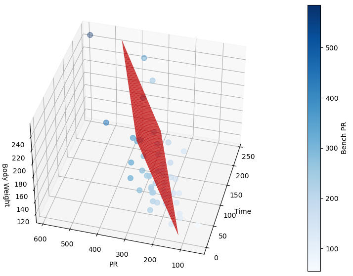

# Bench Press Linear Regression Model
Hello!

I conducted a survey at my local gym. As I was lifting, I went around and asked 50 individuals three questions,
How long have you been going to the gym?
What is your max bench PR, if you bench? (If is crucial, we want people who consistently have the Bench Press as apart of their program)
What is your current Body Weight?

# My Hypothesis
My hypothesis essentially, was to prove already general knowledge. Does more time training in the gym, along with an increase in body weight (assumed lean mass, reasons below) 
always result in an increased Bench Press? Now, generally, that is common knowledge, as you progress in the gym, 
you will correct your technique, your form will improve, you will start to eat better, you will sleep better, (more on this later) and other common sense things. You will also naturally get stronger, along with accumulating lean mass.
So quite frankly, its “obvious” that yes, you will get stronger, if you spend more time in the gym and get bigger.

# The Model
The Regression Equation is:

The Coefficient of Determination is **R2 = 0.6291.** 
However, for a linear regression equation that assumes all variables are linear, like lean-mass gain against time spent in the gym, and for it being biological data, a score of 0.6291 is pretty good. 
Showing that there is indeed a generally strong correlation between time spent in the gym, your bodyweight, along with your Bench press PR.

# Chart

# Interpretation 
As you can see in the chart, the red regression plane typically shows a positive relationship and it shows that bench press strength tends to rise when you have more time spent in the gym, along with weighing more. However, when calculating error, the model does indeed tend to under predict when compared to the real data provided. There is a standard deviation of 55. With a mean error of 0. Now, this can be caused by problems arising from the fact that is a linear regression equation, as it makes a couple assumptions basically.

Ideally, however, this would not be a linear regression equation. As we know, typically, you have exponential “noob gains” during your first 3 months in the gym, then for the next 2-4 years, your Bench Press, will go up linearly, once could assume a general trend of 5ish pounds per month. However, we soon approach biological limits, such as plateaus. Therefore you may indeed explode in the first 3 months, linearly progress by 5 pounds a month in the following 9-48 months, then however, you will start to taper off. You will start having to micro-load, you may need to adapt your strength, if you’re pushing 1RM’s too often, strength can result in a wave pattern, etc. 

We could also talk about how, your BodyWeight, one variable in the regression equation, is absolutely not linear, even if we didn’t assume relatively lean mass. Most lifters will reach a peak physique, at a certain point in time, then it becomes very very difficult to put on more lean mass. Jeff Nippard, a professional sports scientist, trained for 365 with absolute perfect technique, sleep, nutrition, etc under supervision, his total lean mass gain within 365 days, was only ~2.6lbs. As you can see, that in it self already poses a problem, because our equation assumes a linear growth of 1.10lbs per month. Which is extremely unrealistic. That however is a completely separate problem then we introduce bulking and cutting. An average 5’8” male, weighing 165, pounds, could  bulk 10lbs up to 175, but also cut 10lbs to 155. Or go up 20lbs, or down 20lbs. However we are now derailing from the main idea of the README. 

# Conclusion 
As you can see, there are many many non-linear issues that in the real world would highly point towards the idea that ideally, this would be a polynomial linear regression equation, with all sorts of exponential decay, growth, logarithmic growth, etc. Realistically, we would need additional parameters as well, like sleep, calories, etc.

However, to recap, despite the fact that we made general assumptions, and we are using a linear regression equation that has unrealistic assumptions, a coefficient of determination of R2 = 0.6291, for biological data that can be influenced by many factors, is extremely solid. And, pretty good for my first ever ML project.

If you have any further questions, please feel free to contact me.
